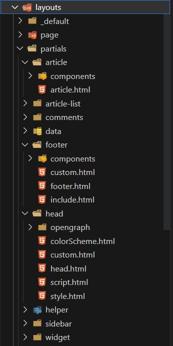
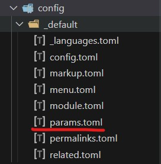
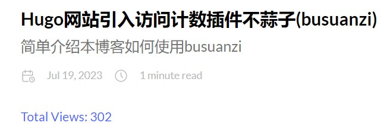
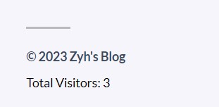

## [busuanzi](http://busuanzi.ibruce.info/)

大多数博客都是静态网站，静态既是优点也是缺点，优点包括但不限于快速的加载速度、较低的服务器要求以及更高的安全性等等；但同时由于是静态的，一些动态内容（交互等等）需要借助第三方平台，不蒜子（busuanzi）是由Bruce 开发的一款轻量级的网页计数器。使用非常简单：**两行代码可搞定**， 一行脚本，一行标签。

### 统计指标

busuanzi有两种统计指标，**PV**和**UV**

- **PV** 即 **Page View**，**网站浏览量**指页面的浏览次数，用以衡量网站用户访问的网页数量。用户每打开一个页面便记录 1 次 PV，多次打开同一页面会累计浏览量。
- **UV** 即 **Unique Visitor**，**独立访客数**指 1 天内访问某站点的人数，以 cookie 为依据。1 天内同一访客的多次访问只计为 1 个访客。

### 简单使用示例

1. 先引入`busuanzi`的`js`代码

```html
<script async src="//busuanzi.ibruce.info/busuanzi/2.3/busuanzi.pure.mini.js"></script>
```

2. 按需使用Html标签代码，注意要使用对应的`id`，例如网站总访问量要使用`busuanzi_container_site_pv`和`busuanzi_value_site_pv`。下面是一个例子：

```html
<span id="busuanzi_container_site_pv">本站总访问量<span id="busuanzi_value_site_pv"></span>次</span>
<span id="busuanzi_container_site_uv">本站总访客数<span id="busuanzi_value_site_uv"></span>人</span>
<span id="busuanzi_container_page_pv">本文总阅读量<span id="busuanzi_value_page_pv"></span>次</span>
```

## Hugo引入

本站采用的是[Stack主题](https://stack.jimmycai.com/)，引入`busuanzi`时需要修改对应的模板页和配置文件，Stack主题的模板页结构如下图：



修改的`html`文件有：

- `layouts\partials\article\components\content.html`

- `layouts\partials\footer\footer.html`

- `layouts\partials\head\head.html`

### head.html

在`head.html`中引入`busuanzi`的js代码

```html
<!-- busuanzi -->
{{- if .Site.Params.busuanzi.enable -}}
  <script async src="//busuanzi.ibruce.info/busuanzi/2.3/busuanzi.pure.mini.js"></script>
  <meta name="referrer" content="no-referrer-when-downgrade">
{{- end -}}
```

### footer.html

`footer.html`定义了整个网站的底部结构，在其中添加总访客数

```html
{{ if .Site.Params.busuanzi.enable }}
  <div class="busuanzi-footer">
    <span id="busuanzi_container_site_uv">
      Total Visitors: <span id="busuanzi_value_site_uv"></span>
    </span>
  </div>
 {{ end }}
```

### content.html

`content.html`是所有文章内容的模板页，在其中添加文章的总浏览量，并且还可以使用自己想要的样式（我把颜色设成了浅蓝）

```html
{{ if .Site.Params.busuanzi.enable }}
    <span id="busuanzi_container_page_pv" style="color: rgb(60, 106, 255)">Total Views: <span
            id="busuanzi_value_page_pv"></span></span>
{{ end }}
```

### 配置文件

最后要修改配置文件`params.toml`，文件位置如下图所示：



添加如下代码：

```toml
[busuanzi]
enable = true
```

如果不想使用计数功能，将`enable`设为`false`即可

## 最终效果

文章浏览量



网站访客数


